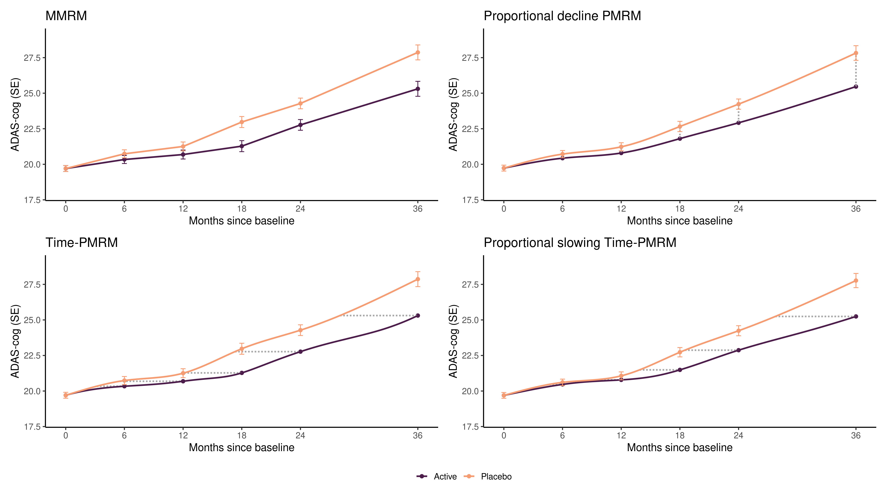
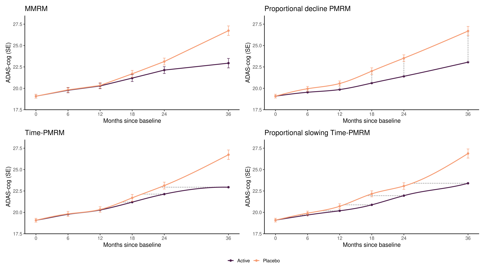

# Progression Models for Repeated Measures

This repository contains code for fitting some of the models described in 

Raket, Lars Lau. "Progression models for repeated measures: Estimating novel treatment effects in progressive diseases." (2022). 

The models enable time-quantifications of treatment effects in clinical trials (e.g. 20% slowing of time-progression or 6 months delay of progression after 2 years of treatment).

Example 1
--------------------
In the example below, a treatment effect resulting in 20% slowing of time-progression of disease was simulated. The results of the MMRM, Proportional decline PMRM, Time-PMRM and Proportional slowing Time-PMRM are shown. Only small differences can be observed between the different models and the Proportional slowing Time-PMRM model had the lowest AIC.

Example 2
--------------------
In the example below, a treatment effect resulting in accelerated slowing of time-progression of disease was simulated. The results of the MMRM and Time-PMRM can both model this treatment effect, while the constraints of the Proportional decline PMRM and Proportional slowing Time-PMRM does not fully allow modeling of this treatment effect and thus finds the closest alternative.

